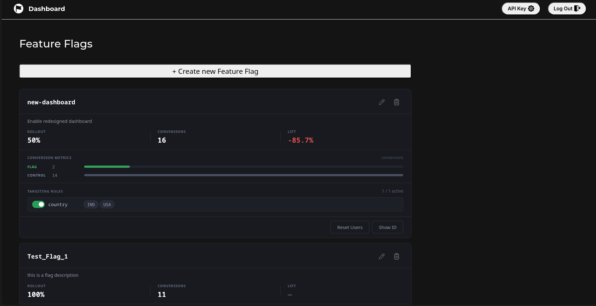
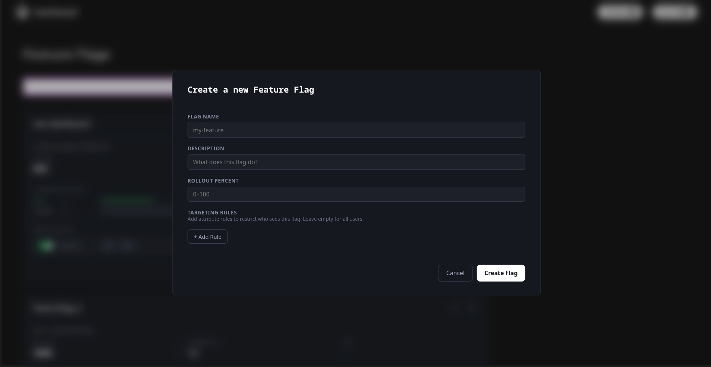

# FlagShip

Feature flag management platform built around an SDK-first architecture.

FlagShip allows teams to create feature flags, define targeting rules, control rollouts, and measure experiment results. Applications evaluate flags locally through the SDK, avoiding runtime network calls and reducing latency.

## Architecture

Unlike traditional feature flag systems that perform remote evaluation, FlagShip distributes configuration to SDK clients.

1. Application starts
2. SDK fetches flag configuration from FlagShip
3. Configuration is cached locally
4. Flag evaluation happens entirely in-process

This provides:

* Zero network latency during evaluation
* Deterministic user assignments
* Reduced backend load
* Consistent behavior across requests

---

## Features

### Feature Flags

* Create, update, and delete feature flags
* Gradual percentage rollouts
* Per-flag descriptions and metadata
* Deterministic sticky bucketing
* User reassignment through seed resets

### Targeting Rules

Target users using arbitrary attributes:

```json
{
  "plan": "pro",
  "country": "US",
  "deviceType": "mobile"
}
```

Rules can match any attribute supplied by the SDK.

### Experiment Analytics

Track conversions and compare:

* Treatment group conversions
* Control group conversions
* Relative lift percentage

### SDK Authentication

SDK clients authenticate using API keys generated from the dashboard.

### JavaScript SDK

Official SDK for local flag evaluation:

```bash
npm install @tanmaybajpai/flagship-js-sdk
```

---

## Technology Stack

| Component | Technology                  |
| --------- | --------------------------- |
| Frontend  | React, Vite                 |
| Backend   | Spring Boot, Java 17        |
| Database  | MariaDB                     |
| ORM       | Hibernate / Spring Data JPA |
| Security  | Spring Security             |
| Build     | Maven                       |

---

## Getting Started

### Requirements

* Java 17+
* Node.js 18+
* MariaDB

Create the database:

```sql
CREATE DATABASE featureflagsdb;

CREATE USER 'flagship-user'@'localhost'
IDENTIFIED BY 'flagship-password';

GRANT ALL PRIVILEGES
ON featureflagsdb.*
TO 'flagship-user'@'localhost';
```

### Run Backend

```bash
./mvnw spring-boot:run
```

The application will be available on:

```text
http://localhost:8080
```

### Run Frontend (Development)

```bash
cd Frontend

npm install
npm run dev
```

Vite runs on port `5173` and proxies API requests to the backend.

### Build Frontend

```bash
cd Frontend
npm run build
```

Copy the generated files into:

```text
src/main/resources/static/
```

---

## JavaScript SDK

```javascript
import FlagShip from '@tanmaybajpai/flagship-js-sdk';

const flagship = new FlagShip({
  apiKey: 'your-api-key',
  baseUrl: 'https://your-server.com'
});

await flagship.init();

const enabled = await flagship.evaluate(
  'new-checkout',
  'user-123',
  {
    plan: 'pro',
    country: 'US'
  }
);
```

Track a conversion event:

```javascript
await flagship.trackSuccess('user-123');
```

See the SDK documentation for the complete API reference.

---

## REST API

SDK endpoints require an API key supplied through:

```http
X-API-Key: <api-key>
```

### Fetch Configuration

```http
GET /api/config
```

Returns all feature flag configuration for the account.

### Record Conversion

```http
POST /api/success?userId=user-123
```

Records a successful conversion event.

---

## Sticky Bucketing

User assignment is deterministic.

```text
userId | flagName | seed
```

The combined value is:

1. Hashed using SHA-256
2. Converted to an unsigned 64-bit integer
3. Mapped into a bucket from 0–99

```text
bucket = hash % 100
```

A flag is enabled when:

```text
bucket < rolloutPercentage
```

Because the same input always produces the same bucket, users remain consistently assigned across sessions.

Resetting a flag regenerates its seed and redistributes users without changing the rollout percentage.

---

## Conversion Lift

Lift is calculated as:

```text
flagRate    = flagConversions / rolloutPercent
controlRate = controlConversions / (100 - rolloutPercent)

lift = ((flagRate - controlRate) / controlRate) * 100
```

Positive values indicate the feature outperformed the control group.

---

## Screenshots

### Login


### Dashboard



### Create Feature Flag


